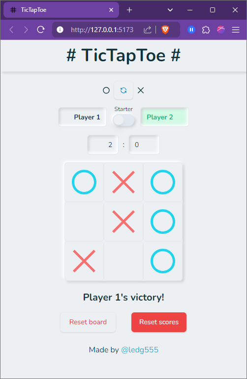

# TicTapToe

A TicTacToe game with neumorphic design.

## Features
🟢 Scores bar that displays and updates the games won by each player  
🟢 A Players bar that allows the players to customize their name 
🟢 The Shape switch allows the players to choose their favorite shape 
🟢 Starter switch to choose the player that opens the game 
🟢 The Players bar shows a green background to tell which player's turn it is 
🟢 The reset bar lets the players to either reset the board, or all the scores 
🟢 A Victory message is shown to indicate which player won the current game 

## Languages and tools
🔡 HTML  
🔡 CSS 
🔡 JavaScript 
⛏️ React (with Vite) 
⛏️ Tailwind CSS 
⛏️ Shadcn-ui 
